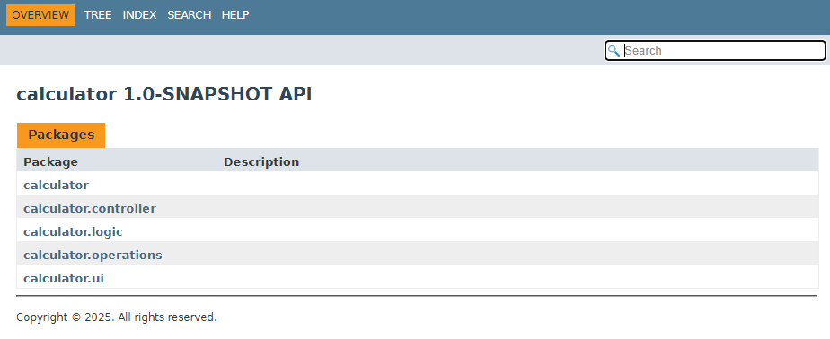

# java-calculator

## Description

This project is intended to use OOP to program a calculator with a simplistic UI.

## Requirements

- Apache Maven 3.9.9
- Java 23.0.2

Note: this project likely functions across multiple versions, but in case it doesn't, use the versions specified above.

## Instructions

### Running

To clone the code from the repository, use the command

`git clone https://github.com/mfk99/java-calculator`

!Note: When running `mvn` commands, you must be in the `calculator`-directory, where e.g.`pom.xml` and `src` are located!

To compile the project, use

`mvn clean compile`

And to run the project, use

`mvn exec:java`

### Testing

To run the tests, use

`mvn test`

<!---
TODO: Create E-2-E and unit tests, add codecov
--->

### Documentation

The project uses Javadoc to produce documentation.
Javadoc is integrated into Maven, so to generate the report, use 

```mvn javadoc:javadoc```

This will create the documentation into the `target/site/apidocs` folder. 
Drag the `index.html` to your browser of choice to view the documentation.
This opens up a view which looks like the following:


<!---
TODO: Configure javadoc to create to seperate folder
--->

## Time used

- General setup: 1,5h
- Development: 11h
- Documentation: 2h
