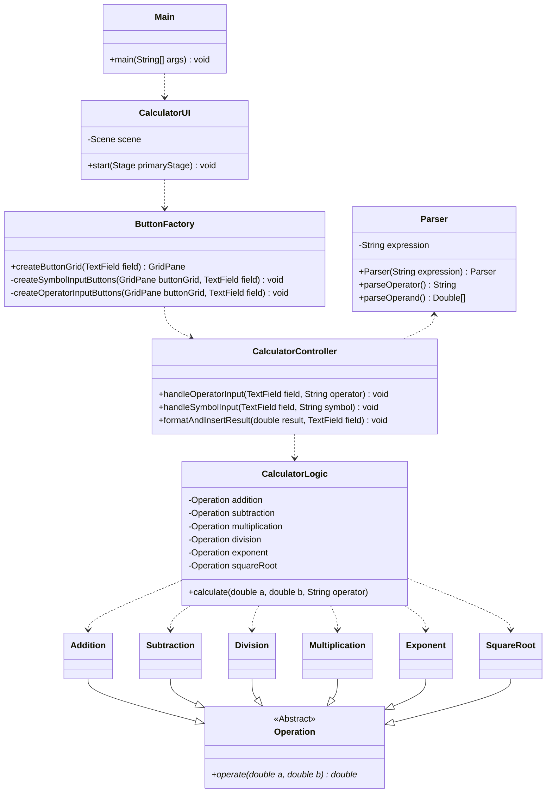
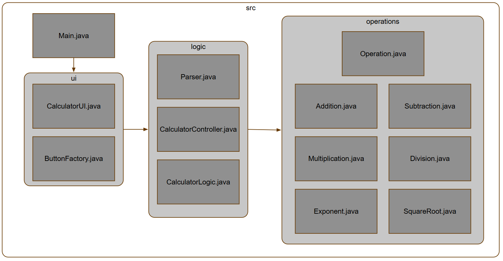

# java-calculator

This project uses OOP to program a calculator with a GUI.

## Description

The main goal of this project was to demonstrate how OOP can be used to create a simple application.
Especial attention was paid to documentation and testing. 
As this was a side project, many desired functionalities are missing, but the existing features are functional.

A class diagram representing the project's architecture has been provided below:



A file diagram to represent the file herarchy.
(This diagram is also available as a [.graphml-file](assets/java-calculator.graphml)).



## Technologies

The project has been built with the following technologies:

| Technology  | Utility | Version |
| ----- | ----- | ----- |
| Java  | Programming language  | 23.0.2 |
| Apache Maven | Project management  | 3.9.9 |
| Javadoc | Code documentation  | 3.6.2 |
| Junit | Unit testing  | 5.11.0 |
| TestFX | End-To-End testing  | 4.0.18 |
| JaCoCo | Test Coverage Reporting  | 0.8.12 |

If you want further information about the project's dependancies, run
`mvn site` in the project directory. This will create the `target/site`-directory, where `index.html` contains further information about Maven dependancies.

## Instructions

### Requirements

This project only requires Java and Maven to function. 
This project likely functions across multiple versions, but in case it doesn't, please use the [versions specified](#technologies).
Git Bash is the easiest method of copying the project, but the source code can be downloaded without it.


### Running

To clone the code from the repository, use the command

`git clone https://github.com/mfk99/java-calculator`

Note: When running `mvn` commands, you must be in the project directory, where e.g.`pom.xml` and `src` are located!

To compile the project, use

`mvn clean compile`

after which you can run the project using

`mvn exec:java`

### Testing

To run the tests, use

`mvn test`

This will run the tests using Junit and TestFX, additionally it  generates two test reports.
1. **JaCoCo** To view the JaCoCo report, go to the `target/site/jacoco`-folder you'll find `index.html`, which will contain information on the test run, as well as test coverage and branch coverage. To view, the report, drag it to the browser of your choice.
2. **Surefire** To view the surefire report, go to the `target/site`-folder you'll find `surefire-report.html`, which will contain information on the test run.


### Documentation

The project uses Javadoc to produce code documentation.
Javadoc is integrated into Maven, so to generate the report, use 

```mvn javadoc:javadoc```

This will create the documentation into the `target/site/apidocs` folder. 
Drag the `index.html` to your browser of choice to view the documentation.
This opens up a view which looks like the following:


### Command cheat sheet

| command  | What does it do? | 
| ----- | ----- | 
| `git clone https://github.com/mfk99/java-calculator`  | Clones the repository to your computer |
| `mvn clean compile` |Compiles the project |
| `mvn exec:java` | Runs the project |
| `mvn test` | Runs the tests, generates test reports |
| `mvn site` | Generates documentation |
| `mvn javadoc:javadoc` | Generates javadoc documentation |

## Time used

- General setup: 1,5h
- Development: 11h
- Documentation: 5h
- Testing: 3,5h (Unit tests: 1,5h, E2E: 2h)
- Total: 20h
