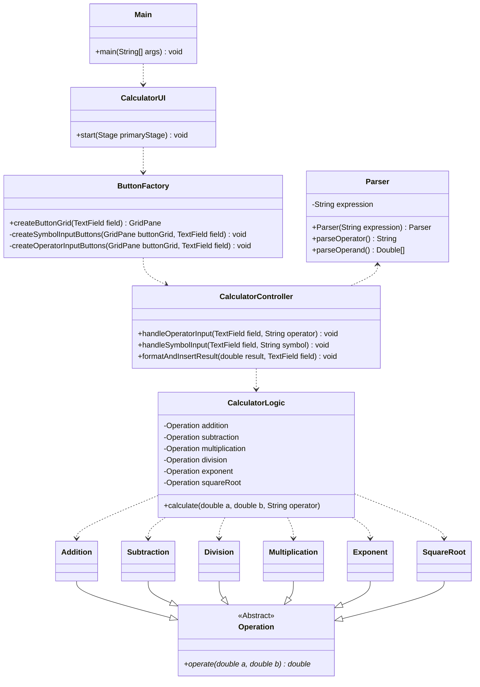

# java-calculator

## Description

This project uses OOP to program a calculator with a GUI.

A class diagram has been provided below:



Additionally, there is a file diagram to represent the file herarchy.
(This diagram is also available as a [.graphml-file](assets/java-calculator.graphml)).


## Technologies

The project has been built with the following technologies:

- Apache Maven 3.9.9
- Java 23.0.2

Note: this project likely functions across multiple versions, but in case it doesn't, please use the versions specified above.
If you want further information about the project's dependancies, run
`mvn site` in the project directory. This will create the `target/site`-directory, where `index.html` contains further information about Maven dependancies.

## Instructions

### Running

To clone the code from the repository, use the command

`git clone https://github.com/mfk99/java-calculator`

Note: When running `mvn` commands, you must be in the project directory, where e.g.`pom.xml` and `src` are located!

To compile the project, use

`mvn clean compile`

And to run the project, use

`mvn exec:java`

### Testing

To only run the tests, use

`mvn test`

This will run the tests using Junit and TestFX, additionally it  generates two test reports.
1. **JaCoCo** To view the JaCoCo report, go to the `target/site/jacoco`-folder you'll find `index.html`, which will contain information on the test run, as well as test coverage and branch coverage. To view, the report, drag it to the browser of your choice.
2. **Surefire** To view the surefire report, go to the `target/site`-folder you'll find `surefire-report.html`, which will contain information on the test run.


### Documentation

The project uses Javadoc to produce code documentation.
Javadoc is integrated into Maven, so to generate the report, use 

```mvn javadoc:javadoc```

This will create the documentation into the `target/site/apidocs` folder. 
Drag the `index.html` to your browser of choice to view the documentation.
This opens up a view which looks like the following:


<!---
TODO: Configure javadoc to create to seperate folder
--->

## Time used

- General setup: 1,5h
- Development: 11h
- Documentation: 5h
- Testing: 3,5h (Unit tests: 1,5h, E2E: 2h)
- Total: 20h